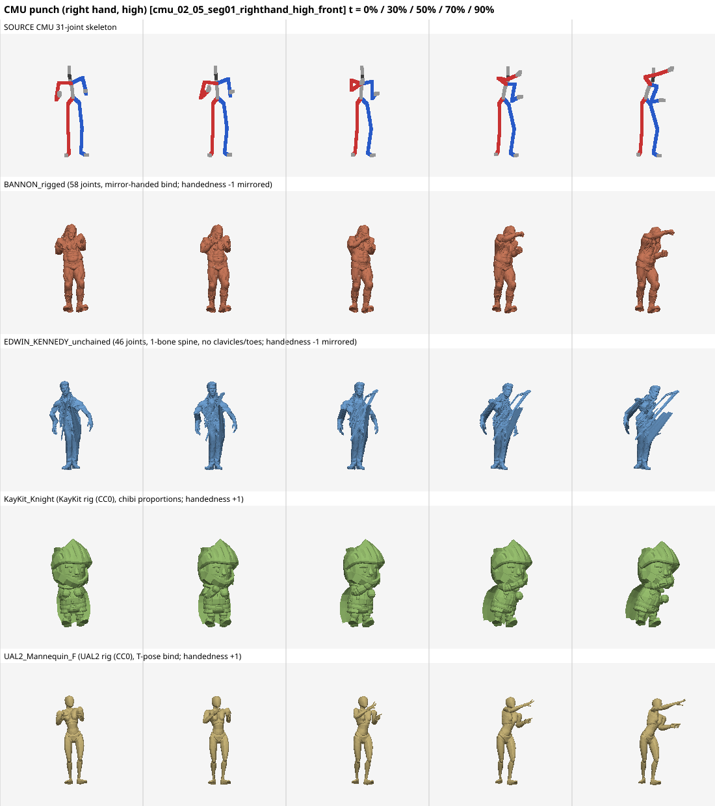
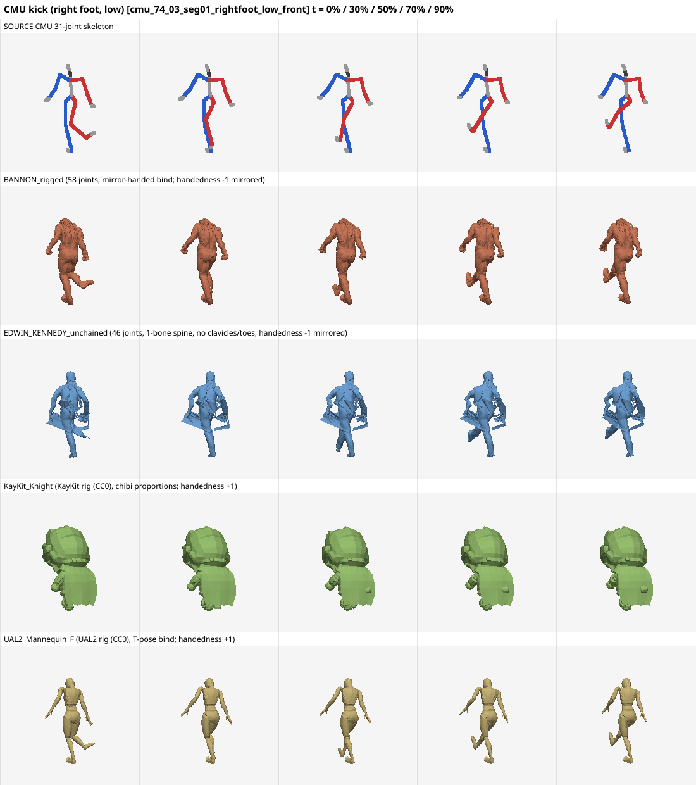

# Universal retarget visual proof

Generated by `npm run retarget:proof` (software rasterizer over the real skinned meshes; no GPU).
Each image: the same CMU source clip; top row = source skeleton (blue = left, red = right), other rows = contrasting target rigs, sampled at the listed time fractions, 3/4 view from each rig's own front (derived from its measured frame, so mirrored binds are shown facing the camera too).

The view is fixed per rig (its rest front), so when the clip turns the body the figures are seen from behind; all rows turn the same way as the source.

Known asset artifact: EDWIN_KENNEDY_unchained's mesh has triangles welded between the forearms/hands and the hips/thighs (about 500 bridging triangles in the bind pose, plus arm vertices carrying ~0.1 Hips weight), so any arm raise stretches those triangles into streaks. The skeleton pose is correct; the stretching is from the skin weights, not from the retargeter.

CMU source data is CMU-free-use (not CC0) and is not committed; these PNGs are derived renders.

- 
- 
